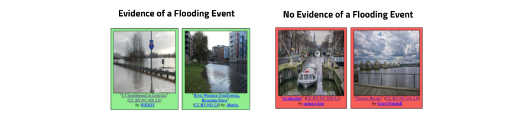
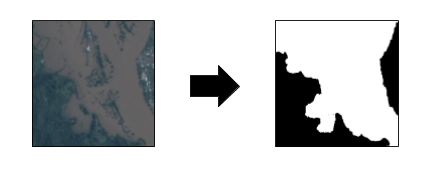

# 2017-Multimedia-Satellite-Task

## What is this task about?

The multimedia satellite task requires participants to retrieve and link multimedia content from social media streams (Flickr, Twitter, Wikipedia) of events that can be remotely sensed such as flooding, fires, land clearing, etc. to satellite imagery. The purpose of this task is to augment events that are present in satellite images with social media reports in order to provide a more comprehensive view. This is of vital importance in context of situational awareness and emergency response for the coordination of rescue efforts.

To align with recent events, the challenge focuses on flooding events, which constitute a special kind of remotely sensed event. The multimedia satellite task is a combination of satellite image processing, social media retrieval and fusion of both modalities. The different challenges are addressed in the following two subtasks. 

* **Disaster Image Retrieval from Social Media [DIRSM]**<br>
The goal of this task is to retrieve all images which show direct evidence of a flooding event from social media streams, independently of a particular event. The objective is to design a system/algorithm that given any collection of multimedia images and their metadata (e.g., YFCC100M, Twitter, Wikipedia, news articles) is able to identify those images that are related to a flooding event. Please note, that only those images which convey an evidence of a flooding event will be considered as True Positives. Specifically, **we define images showing „unexpected high water levels in industrial, residential, commercial and agricultural areas“ as images providing evidence of a flooding event**. The main challenges of this task are the proper discrimination of the water level in different areas (e.g., images showing a lake vs. showing high water at a street) as well as the consideration of different types of flooding events (e.g., coastal flooding, river flooding, pluvial flooding). 


* **Flood-Detection in Satellite Images [FDSI]**<br>
The aim of this task is to develop a method/algorithm that is able to identify regions affected by a flooding in satellite images. Participants get image patches of satellite images which cover a wide spatial area for multiple instances of flooding events. The satellite image patches are provided by the organizers of the task and are recorded during (or shortly after) the flooding event. For a list of flooding events at different locations, participants report for given image patches segmentation masks of the flooded area. The percentage of correctly labeled pixels will be evaluated.



## What data is provided?

The images and corresponding metadata for the DIRSM task have been extracted from YFCC100M-Dataset. These images are shared under Creative Commons licenses that allow their redistribution. All images are sampled in a way such that there is only one image per user in the dataset. Images will be labeled with the two classes (1) Showing evidence of a flooding event and (2) Showing no evidence of a flooding event. In addition to the images, we will also supply participants with additional metadata information. We will release a development set of 5280 images. Precomputed features will be provided along with the dataset to help teams from different communities to participate to the task.

For the FDSI task, we will provide satellite image patches of flooded regions recorded during (or shortly after) a flooding event. The dataset will contain image patches for different instances of flooding events. The patches have been extracted from [Planet's four band satellites](https://www.planet.com/) (3 meter per pixel resolution) gathered from Planet [[7](#References)] as underlying source of data. For each satellite image patch, we provide a segmentation mask, in which each pixel contains a class label for background or the flooded area.


## How is the performance measured?

The images for the DIRSM task are to be manually annotated with the two class labels (showing evidence/showing no evidence of a flooding event) by human assessors. The correctness of retrieved images will be evaluated with the metric Average Precision at X (AP@X) at various cutoffs, X={50,100, 200, 300, 400, 500}. The metric measures the number of relevant images among the top X retrieved results and takes the rank into consideration.

The segmentation masks of flooded areas in the satellite images for the FDSI task have been extracted by human assessors. The official evaluation metric for the generated segmentation masks of flooded areas in the satellite image patches is the Jaccard Index, commonly known as the PASCAL VOC intersection-over-union metric: 

```
IoU = TP / (TP + FP + FN)
```

where TP, FP, and FN are the numbers of true positive, false positive, and false negative pixels, respectively, determined over the whole test set. The evaluation is based on two test-sets: 
* Evaluation on unseen patches which are extracted from the same region as in the dev-set
* Evaluation on unseen patches which are extracted from a new region not being present in the dev-set.


## What are important dates for Task-Participation?
<div align="center" markdown="1" style="width:100%">
<table>
<tbody>
<tr>
<td align="left">May 1, 2017</td>
<td align="left">Development data release</td>
</tr>
<tr>
<td align="left">June 1, 2017</td>
<td align="left">Test data release</td>
</tr>
<tr>
<td align="left">August 17, 2017</td>
<td align="left">Run submission due</td>
</tr>
<tr>
<td align="left">August 21, 2017</td>
<td align="left">Results returned to the participants</td>
</tr>
<tr>
<td align="left">August 28, 2017</td>
<td align="left">Working notes paper initial submission deadline</td>
</tr>
<tr>
<td align="left">August 30, 2017</td>
<td align="left">Working notes review returned to the participants</td>
</tr>
<tr>
<td align="left">September 4, 2017</td>
<td align="left">Camera ready working notes paper due</td>
</tr>
<tr>
<td align="left">September 13-15, 2017</td>
<td align="left">MediaEval Workshop, Dublin, Ireland</td>
</tr>
<tr>
<td align="left"></td>
<td align="left"></td>
</tr>
</tbody>
</table>
</div>

## Who are the task organizers?
* Benjamin Bischke, German Research Center for Artificial Intelligence (DFKI), Germany (first.last at dfki.de)
* Damian Borth, German Research Center for Artificial Intelligence (DFKI), Germany (first.last at dfki.de)
* Christian Schulze, German Research Center for Artificial Intelligence (DFKI), Germany (first.last at dfki.de)
* Venkat Srinivasan, Virginia Tech (Blacksburg VA), US
* Alan Woodley, Queensland University of Technology (QUT), Australia

## Where to get more information?
Detailed information on the task including description of the data, provided features, run submission, etc. can be found on the [task wiki](https://github.com/multimediaeval/2017-Multimedia-Satellite-Task/wiki).
If you need help or have any questions please contact Benjamin Bischke (firstname.lastname at dfki.de).


## What are recommended readings and task references?

1. Bischke, Benjamin, et al. "[Contextual enrichment of remote-sensed events with social media streams.](https://www.google.nl/url?sa=t&rct=j&q=&esrc=s&source=web&cd=1&ved=0ahUKEwiA5au1k6zSAhVFVhQKHc7NCc4QFggaMAA&url=https%3A%2F%2Fwww.dfki.de%2Fweb%2Fresearch%2Fpublications%2FrenameFileForDownload%3Ffilename%3D2964284.2984063_socialsatellite_cameraready.pdf%26file_id%3Duploads_2962&usg=AFQjCNGg6Uxc0XqpOkhnADfF_sgsx96Q_Q&sig2=AQR_fLqYNLXSKD7-052Q3Q&bvm=bv.148073327,d.d24)" Proceedings of the 2016 ACM on Multimedia Conference. ACM, 2016.

2. Chaouch, Naira, et al. "[A synergetic use of satellite imagery from SAR and optical sensors to improve coastal flood mapping in the Gulf of Mexico.](https://www.researchgate.net/publication/227694697_A_synergetic_use_of_satellite_imagery_from_SAR_and_optical_sensors_to_improve_coastal_flood_mapping_in_the_Gulf_of_Mexico)" Hydrological Processes 26.11 (2012): 1617-1628.

3. Klemas, Victor. "[Remote sensing of floods and flood-prone areas: an overview.](http://www.bioone.org/doi/10.2112/JCOASTRES-D-14-00160.1)" Journal of Coastal Research 31.4 (2014): 1005-1013.

4. Lagerstrom, Ryan, et al. "[Image classification to support emergency situation awareness.](http://eprints.qut.edu.au/98961/)" Frontiers in Robotics and AI 3 (2016): 54.

5. Ogashawara, Igor, Marcelo Pedroso Curtarelli, and Celso M. Ferreira. "[The use of optical remote sensing for mapping flooded areas.](http://www.ijera.com/papers/Vol3_issue5/LL3519561960.pdf)" International Journal of Engineering Research and Application 3.5 (2013): 1-5. 

6. Peters, Robin, and J. P. D. Albuquerque. "[Investigating images as indicators for relevant social media messages in disaster management.](http://iscram2015.uia.no/wp-content/uploads/2015/05/8-4.pdf)" The 12th International Conference on Information Systems for Crisis Response and Management. 2015.

7. [Planet Team](http://www.planet.com) (2017). Planet Application Program Interface: In Space for Life on Earth. San Francisco, CA. 

8. Schnebele, Emily, et al. "[Real time estimation of the Calgary floods using limited remote sensing data.](http://www.mdpi.com/2073-4441/6/2/381)" Water 6.2 (2014): 381-398.

9. Ticehurst, C. J., P. Dyce, and J. P. Guerschman. "[Using passive microwave and optical remote sensing to monitor flood inundation in support of hydrologic modelling.](http://www.mssanz.org.au/modsim09/I10/ticehurst_I10.pdf)" Interfacing modelling and simulation with mathematical and computational sciences, 18th World IMACS/MODSIM Congress. 2009.

10. Wedderburn-Bisshop, Gerard, et al. "[Methodology for mapping change in woody landcover over Queensland from 1999 to 2001 using Landsat ETM+.](http://citeseerx.ist.psu.edu/viewdoc/download?doi=10.1.1.118.8447&rep=rep1&type=pdf)" Department of Natural Resources and Mines, 2002.

11. Woodley, Alan, et al. "[Introducing the Sky and the Social Eye.](http://ceur-ws.org/Vol-1739/MediaEval_2016_paper_9.pdf)" Working Notes Proceedings of the MediaEval 2016 Workshop. Vol. 1739. CEUR Workshop Proceedings, 2016. 

12. Yang, Yimin, et al. "[Hierarchical disaster image classification for situation report enhancement.](https://users.cs.fiu.edu/~chens/PDF/IRI11_Disaster.pdf)" Information Reuse and Integration (IRI), 2011 IEEE International Conference on. IEEE, 2011.
